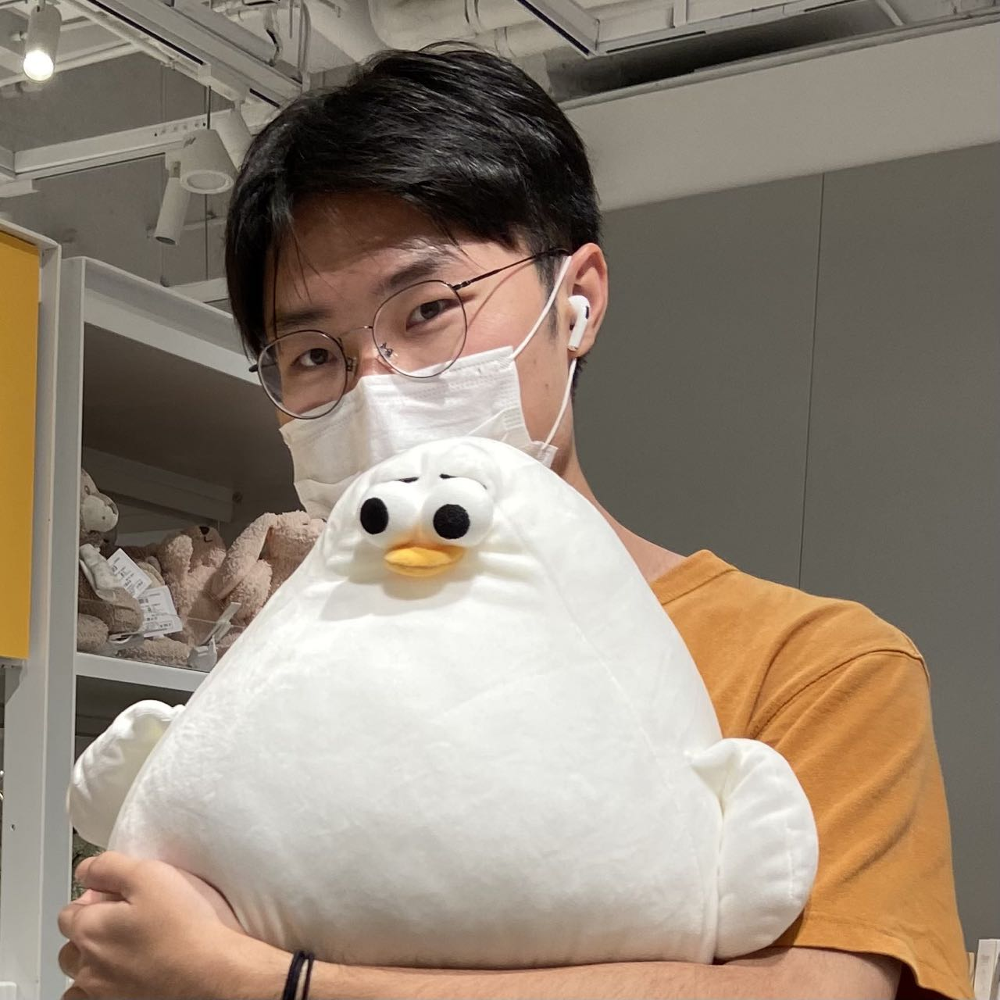

# Hi😄, I am Li(family name) Suju(given name)

## Introduction :raised_hands:

Student of SCUT :school:

Major in Software Engineering :man_technologist:

Speak 5 languages (Mandarin,English,Japanese,Cantonese,Hakka) :heart:

## Orientation :dart:

I love coding. :heart:

I love full stack technologys. :heart:

## Online Projects :computer:

&nbsp;

### Bugu Sport

&nbsp;
### goSearch

